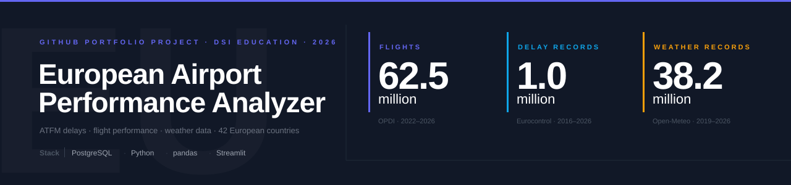
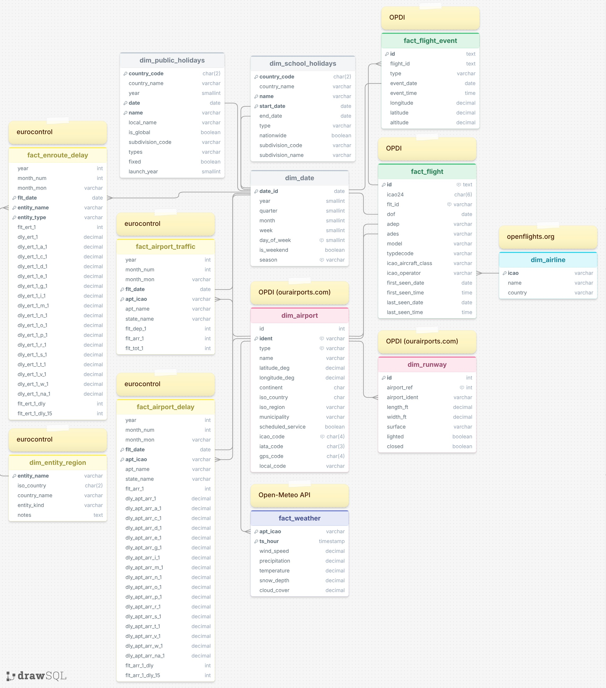

> A full-stack data engineering and analytics project integrating European flight
> delay and weather data into a single PostgreSQL warehouse, delivering rankings,
> cause analyses, and an interactive dashboard for air traffic performance insights.

[](https://www.python.org/)
[](https://www.postgresql.org/)
[](https://streamlit.io/)

---

## Table of Contents

- [Overview](#overview)
- [Features](#features)
- [Architecture](#architecture)
- [Tech Stack](#tech-stack)
- [Data Sources](#data-sources)
- [Database Schema](#database-schema)
- [Project Structure](#project-structure)
- [Installation](#installation)
- [Configuration](#configuration)
- [Usage](#usage)
- [Dashboard](#dashboard)
- [Authors](#authors)
- [License](#license)

---

## Overview

### Problem Statement

Air traffic delays cost European airlines, airports and passengers millions of
minutes every year. The underlying performance data is publicly available but
it is scattered across multiple sources, encoded inconsistently and rarely
analyzed in combination.

Key questions remain hard to answer from any single source:

- Which European airports are the least reliable and why?
- Is the root cause at the airport itself, or in the surrounding airspace?
- How strongly does weather drive delay patterns, and does it differ by hub?
- Which ATFM cause codes actually dominate and what do they mean operationally?

### Solution

The **European Airport Performance Analyzer** consolidates three independent
public data sources OPDI flight-level data, Eurocontrol delay
statistics, and Open-Meteo historical weather into a single, reproducible
PostgreSQL star schema. On top of that warehouse, the project delivers:

- Structured EDA notebooks answering the questions above
- correlation analysis linking weather variables to delay outcomes
- An interactive Streamlit dashboard for non-technical stakeholders

### Target Audience

- **Data science students and practitioners** looking for a reference end-to-end
  data engineering pipeline
- **Aviation domain analysts** who want reproducible, queryable delay statistics
- **Hiring managers and recruiters** evaluating portfolio depth in data
  engineering, SQL, and exploratory analysis

### Dataset at a Glance

| Metric | Value |
|--------|-------|
| Individual flights (OPDI) | 62,533,087 |
| ATFM delay records | 1,017,228 |
| Airports with delay data | 293 |
| Airports with weather data | 589 |
| Countries covered | 42 |
| Total IFR arrivals | 74,756,740 |
| Hourly weather records | 38,164,896 |
| Flight data range | Jan 2022 – Mar 2026 |
| Delay data range | Jan 2016 – Mar 2026 |
| Weather data range | Jan 2019 – May 2026 |

---

## Features

| Area | What the project delivers |
|------|--------------------------|
| **Data warehouse** | PostgreSQL star schema combining flight, delay and weather data at airport × day granularity |
| **Airport delay rankings** | ATFM delay normalized per flight arrival (`dly_per_flight`), comparable across airports of all sizes |
| **Cause analysis** | 14 official ATFM delay codes broken down by airport and en-route |
| **Airport vs. airspace** | Terminal-area ATFM delay (attributed to airport) vs. en-route ATFM delay (attributed to airspace / ANSP) compared at country level |
| **Temporal analysis** | Year-over-year trends 2019–2025, seasonal heatmaps, weekday/weekend patterns |
| **Weather correlation** | Correlation of weather variables against delay metrics across ~41 M hourly records; subgroup analysis for eight focus hubs |
| **Flight-level backbone** | OPDI flight list used for route popularity, airline rankings and top airport-pair analysis |
| **Interactive dashboard** | Streamlit app exposing key charts and rankings to end users without SQL |
| **Reproducible pipeline** | Idempotent ETL scripts |

---

## Architecture

```
┌───────────────────────────────────────────────────────────────────────┐
│                          Data Sources                                 │
│                                                                       │
│  OPDI (Parquet)        Eurocontrol (CSV)        Open-Meteo (REST)     │
│  ├─ flight_list        ├─ apt_dly               └─ Historical weather │
│  └─ flight_events      ├─ airport_traffic          per airport        │
│                        └─ ert_dly_ansp                                │
└───────────┬────────────────────┬───────────────────────┬──────────────┘
            │                    │                       │
            ▼                    ▼                       ▼
┌──────────────────────────────────────────────────────────────────────┐
│                        Python ETL Layer                              │
│            psycopg2 COPY (bulk)  ·  pandas  ·  SQLAlchemy v2         │
└───────────────────────────────┬──────────────────────────────────────┘
                                │
                                ▼
┌──────────────────────────────────────────────────────────────────────┐
│                    PostgreSQL Star Schema                            │
│                                                                      │
│  Dimensions                      Facts                               │
│  ├─ dim_airport                  ├─ fact_flight                      │
│  ├─ dim_runway                   ├─ fact_flight_event                │
│  ├─ dim_date                     ├─ fact_airport_delay               │
│  ├─ dim_airline                  ├─ fact_airport_traffic             │
│  ├─ dim_entity_region            ├─ fact_enroute_delay               │
│  ├─ dim_public_holidays          └─ fact_weather                     │
│  └─ dim_school_holidays                                              │
└───────────────────────────────┬──────────────────────────────────────┘
                                │
                    ┌───────────┴───────────┐
                    ▼                       ▼
          Jupyter Notebooks          Streamlit Dashboard
          (EDA · Correlation)        (Interactive UI)
```

---

## Tech Stack

| Layer | Technology |
|-------|-----------|
| Language | Python 3.10+, SQL |
| Database | PostgreSQL 14+ (star schema) |
| Data processing | pandas, psycopg2, SQLAlchemy 2.x |
| Visualization | Plotly, Matplotlib, calplot |
| Dashboard | Streamlit |
| Notebooks | Jupyter |
| Version control | Git / GitHub |
| Environment | Conda / venv |

---

## Data Sources

| Source | Content | Coverage | License |
|--------|---------|----------|---------|
| [OPDI](https://www.opdi.aero/) | ADS-B flight list, flight events | EU, 2022–present | Open |
| [Eurocontrol PRU](https://ansperformance.eu/data) | ATFM airport delay, en-route delay, traffic | EU, 2011–present | Open |
| [OurAirports](https://ourairports.com/data/) | Airport & runway reference data | Global | CC0 |
| [Open-Meteo](https://open-meteo.com/) | Hourly historical weather per airport | Global, 2019–present | CC-BY 4.0 |

> **Note on OPDI flight data:** The `adep_p` / `ades_p` columns in the OPDI
> flight list represent predicted/probable airport codes derived from ADS-B
> coverage gap-filling. They are **not** planned departure/arrival times.
> Individual flight schedule delay cannot be computed from OPDI alone.

All sources are publicly available and free for non-commercial use. Please refer
to each provider for current terms of use.

---

## Database Schema

The project uses a **star schema** in PostgreSQL. All tables are defined in
`database/setup.sql`.



### Dimension Tables

| Table | Primary Key | Description |
|-------|-------------|-------------|
| `dim_airport` | `ident` (ICAO) | Airport reference data (OurAirports) |
| `dim_runway` | `id` | Runway specs per airport |
| `dim_date` | `date_id` | Date spine 2011–2028, auto-generated via `GENERATE_SERIES` |
| `dim_airline` | `icao` | Airline ICAO codes and country |
| `dim_entity_region` | `entity_name` | ANSP / AUA entity → ISO country mapping for en-route joins |
| `dim_public_holidays` | `(country_code, date, name)` | Public holidays by country |
| `dim_school_holidays` | `(country_code, start_date, name)` | School holiday periods by country |

### Fact Tables

| Table | Grain | Key columns |
|-------|-------|-------------|
| `fact_flight` | Flight | `id`, `adep`, `ades`, `dof`, `icao24` |
| `fact_flight_event` | Flight × Event | `flight_id`, `type`, `event_date`, `event_time` |
| `fact_airport_delay` | Airport × Day | `apt_icao`, `flt_date`, `dly_apt_arr_1`, 14 cause-code columns |
| `fact_airport_traffic` | Airport × Day | `apt_icao`, `flt_date`, `flt_dep_1`, `flt_arr_1` |
| `fact_enroute_delay` | ANSP × Day | `entity_name`, `flt_date`, `dly_ert_1`, 14 cause-code columns |
| `fact_weather` | Airport × Hour (UTC) | `apt_icao`, `ts_hour`, wind, precipitation, temperature, snow, cloud |

### ATFM Delay Cause Codes

Both `fact_airport_delay` and `fact_enroute_delay` include a column per official
ATFM cause code:

| Code | Cause |
|------|-------|
| A | Accident / Incident |
| C | ATC Capacity |
| D | De-icing |
| E | Aerodrome Services |
| G | Aerodrome Capacity |
| I | Industrial Action (ATC) |
| M | Military Activity |
| N | Industrial Action (non-ATC) |
| O | Other |
| P | Special Event |
| R | ATC Routeing |
| S | ATC Staffing |
| T | Equipment (ATC) |
| V | Environmental Issues |
| W | Weather |

Reference: [Eurocontrol ATFM Delay Code definitions](https://ansperformance.eu/definition/atfm-delay-codes/)

---

## Project Structure

```
airport-performance-analyzer/
│
├── database/
│   └── setup.sql                     # Full schema definition (DROP + CREATE + seed dim_date)
│
├── data/raw/                         # Raw files (git-ignored)
│   ├── opdi/                         # OPDI Parquet files
│   ├── eurocontrol/                  # Eurocontrol CSV files
│   ├── holidays/                     # Downloaded holiday data
│   ├── openflights/                  # Downloaded airlines data
│   └── weather/                      # Downloaded weather data
│
├── scripts/
│   ├── download/
│   │   ├── download_opdi.py          # Downloads all OPDI-Files (Source: OPDI)
│   │   └── download_weather.py       # Downloads all Weather Data
│   │   └── download_holidays.py      # Downloads all Holiday Data
│   │
│   └── import/
│       ├── import_dimensions.py      # dim_airport, dim_runway, dim_airline, dim_entity_region
│       ├── import_eurocontrol.py     # fact_airport_delay, fact_airport_traffic, fact_enroute_delay
│       ├── import_weather.py         # Bulk COPY fact_weather from downloaded Parquet/CSV
│       ├── import_opdi.py            # fact_flight, fact_flight_event (OPDI Parquet files)
│       └── run_all.py                # Executes all import scripts in the correct order
│
├── notebooks/
│   ├── 00_general overview.ipynb     # Top airports by movement,  ATFM delays
│   ├── 01_delay_ranking.ipynb        # Airport & country ranking, scatter plot delay vs. pct_delayed_15
│   ├── 02_delay_cause.ipynb          # Breakdown of 14 ATFM cause codes, choropleth maps, en-route vs. airport comparison
│   ├── 03_airline_ranking.ipynb      # Airline efficiency ranking
│   ├── 04_delay_heatmap.ipynb        # Seasonal heatmap by weekday × month per airport
│   └── 05_delay_weather.ipynb        # Correlation, scatter plots, box plots by weather category
│
├── streamlit/
│   ├── airport_analyzer.py           # Streamlit application (entry point)
│   ├── subpage01.py                  # Routes & Airline Dashboard
│   └── subpage02.py                  # Airport Dashboard
│
├── LICENSE                           # LICENSE file (MIT)
├── .env.example                      # Environment variable template
├── requirements.txt                  # Python dependencies
└── README.md
```

---

## Installation

### Prerequisites

| Requirement | Version | Notes |
|-------------|---------|-------|
| Python | 3.10+ | Conda or venv recommended |
| PostgreSQL | 14+ | Local install or Docker |
| Disk space | ~100 GB | Full OPDI + weather dataset |
| RAM | 8 GB+ | Recommended for large Parquet ingestion |

### Step 1 — Clone the repository

```bash
git clone https://github.com/sdemmler/airport-performance-analyzer.git
cd airport-performance-analyzer
```

### Step 2 — Set up the Python environment

**With venv:**

```bash
python -m venv .venv
source .venv/bin/activate      # Windows: .venv\Scripts\activate
pip install -r requirements.txt
```

### Step 3 — Configure environment variables

Copy the template and fill in your database credentials:

```bash
cp .env.example .env
```

Edit `.env`:

```env
DB_NAME = <YourDBName>
DB_USER = <YourUserName>
DB_PASSWORD = <YourDBPassword>
DB_PORT=<port>
DB_HOST=localhost/<IP>
```

### Step 4 — Initialize the database schema

```bash
psql -U user -d airport_analyzer -f database/setup.sql
```

This runs a full `DROP IF EXISTS` + `CREATE` cycle and seeds `dim_date`
(2011–2028) automatically. Safe to re-run after schema changes.

### Step 5 — Download raw data

Download the source files manually or via provided scripts:

- **OPDI flight list:** [opdi.aero/flight-list-data.html](https://www.opdi.aero/flight-list-data.html) → `data/raw/opdi/flight_list/`
- **OPDI flight events:** [opdi.aero/flight-event-data.html](https://www.opdi.aero/flight-event-data.html) → `data/raw/opdi/flight_events/`
- **Eurocontrol Airport Traffic:** [ansperformance.eu/csv/#aptflt-csv](https://ansperformance.eu/csv/#aptflt-csv) → `data/raw/eurocontrol/airport_traffic`
- **Eurocontrol Airport Delay:** [ansperformance.eu/csv/#aptdly-csv](https://ansperformance.eu/csv/#aptdly-csv) → `data/raw/eurocontrol/apt_dly`
- **Eurocontrol Enroute Delay:** [ansperformance.eu/csv/#ertdly-csv](https://ansperformance.eu/csv/#ertdly-csv) → `data/raw/eurocontrol/enroute_ansp`
- **OurAirports airports.csv:** [ourairports.com/data/](https://ourairports.com/data/) → `data/raw/opdi/`
- **OurAirports runways.csv:** [ourairports.com/data/](https://ourairports.com/data/) → `data/raw/opdi/`
- **Weather data:** Download via provided import script → `scripts/download/download_weather.py`
- **Holiday data:** Download via provided import script → `scripts/download/download_holidays.py`

### Step 6 — Run the import pipeline

Execute import script **run_all.py**:

```bash
python scripts/import/run_all.py
```

> **Tip:** The weather downloader can take several hours for a full run
> (41 M+ hourly rows across hundreds of airports). Run it in the background:
>
> ```bash
> nohup python scripts/download/download_weather.py > logs/weather.log 2>&1 &
> tail -f logs/weather.log
> ```
>
> Already-loaded airport-hour combinations are automatically skipped on resume.

---

## Configuration

All runtime configuration is handled through the `.env` file:

| Variable | Description | Example |
|----------|-------------|---------|
| `DB_NAME` | Full PostgreSQL connection string | `airport_performance` |
| `DB_USER` | Target schema within the database | `postgres` |
| `DB_PASSWORD` | Full PostgreSQL connection string | `yourpassword` |
| `DB_PORT` | Target schema within the database | `5432` |
| `DB_HOST` | Target schema within the database | `localhost` |

Analysis parameters (date ranges, focus airports, weather variables, API rate
limits) are defined as constants at the top of the respective scripts and
notebooks. No separate config file is required for standard runs.

---

## Usage

### Running the EDA Notebooks

Launch Jupyter and open notebooks:

```bash
jupyter lab
```

### Example SQL Queries

**Top 10 airports by average ATFM delay per arrival (2023):**

```sql
SELECT
    d.apt_icao,
    a.name,
    a.iso_country,
    ROUND(SUM(d.dly_apt_arr_1) / NULLIF(SUM(d.flt_arr_1), 0), 2) AS dly_per_flight
FROM fact_airport_delay d
JOIN dim_airport a  ON d.apt_icao = a.ident
JOIN dim_date   dd  ON d.flt_date = dd.date_id
WHERE dd.year = 2023
GROUP BY d.apt_icao, a.name, a.iso_country
HAVING SUM(d.flt_arr_1) > 1000   -- exclude low-traffic airports
ORDER BY dly_per_flight DESC
LIMIT 10;
```

**En-route delay by country (2023), excluding cross-border entities:**

```sql
SELECT
    er.iso_country,
    er.country_name,
    ROUND(SUM(f.dly_ert_1), 0)              AS total_ert_delay_min,
    ROUND(SUM(f.dly_ert_1) / NULLIF(SUM(f.flt_ert_1), 0), 3) AS dly_per_flight
FROM fact_enroute_delay f
JOIN dim_entity_region  er ON f.entity_name = er.entity_name
JOIN dim_date           dd ON f.flt_date    = dd.date_id
WHERE dd.year = 2023
  AND f.entity_type = 'ANSP (AUA)'
  AND er.iso_country IS NOT NULL    -- excludes MUAC (cross-border)
GROUP BY er.iso_country, er.country_name
ORDER BY dly_per_flight DESC;
```

**Weather vs. delay — daily aggregation for a single airport:**

```sql
SELECT
    w.apt_icao,
    DATE(w.ts_hour)                          AS obs_date,
    AVG(w.wind_speed)                        AS wind_avg,
    SUM(w.precipitation)                     AS precip_total,
    AVG(w.cloud_cover)                       AS cloud_avg,
    d.dly_apt_arr_1 / NULLIF(d.flt_arr_1, 0) AS dly_per_flight
FROM fact_weather        w
JOIN fact_airport_delay  d  ON w.apt_icao = d.apt_icao
                            AND DATE(w.ts_hour) = d.flt_date
WHERE w.apt_icao = 'EGLL'   -- London Heathrow
  AND DATE(w.ts_hour) BETWEEN '2023-01-01' AND '2023-12-31'
GROUP BY w.apt_icao, DATE(w.ts_hour), d.dly_apt_arr_1, d.flt_arr_1
ORDER BY obs_date;
```

---

## Dashboard

From the project's root directory, activate the .venv and run:

```bash
source .venv/bin/activate      # Windows: .venv\Scripts\activate
streamlit run ./streamlit/airport_analyzer.py
```

The app opens at `http://localhost:8501` by default. It reads directly from the
PostgreSQL database using the `DATABASE_URL` defined in `.env`.

---

## Authors

Developed as a Data Science capstone project (DSI Education, 2026).

| Author |
|--------|
| **Sebastian Demmler** |
| **André Janßen** | 

---

## License

This project is developed for educational and portfolio purposes.

- **Code:** MIT License (see `LICENSE`)
- **Data:** Each source retains its original license. Please refer to the
  respective provider's terms before any commercial use.
